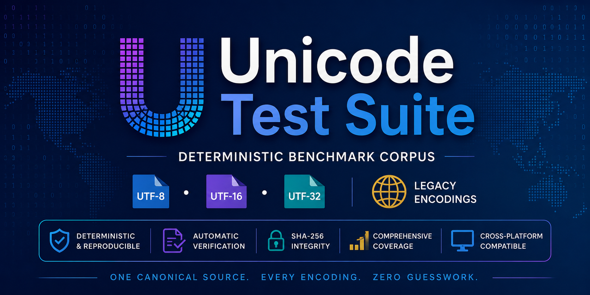

# Unicode Test Suite (UTS)

> **A deterministic, reproducible benchmark corpus for Unicode and text-encoding detection.**

Unicode Test Suite (UTS) is a benchmark corpus for validating and comparing text-encoding detectors, Unicode decoders, converters, editors, file analyzers, and related software.

Every generated file is deterministically produced from a canonical Unicode source, automatically verified after generation, and protected by cryptographic hashes to guarantee long-term reproducibility.

---

## Project

- **Repository:** https://github.com/amrali-eg/UnicodeTestSuite
- **Latest Releases:** https://github.com/amrali-eg/UnicodeTestSuite/releases
- **Issue Tracker:** https://github.com/amrali-eg/UnicodeTestSuite/issues

## Features

- Deterministic corpus generation
- Bit-identical reproducible output
- Cross-platform
- Versioned releases
- Machine-readable metadata
- Automatic post-generation verification
- SHA-256 integrity verification
- Stable document identifiers
- Stable filenames
- Stable manifest format
- Extensible architecture
- Public benchmark quality

## Encoding Compatibility

UnicodeTestSuite intentionally includes only character encodings that can be used reliably across both **Python** and **.NET**.

When selecting encodings, priority was given to identifiers that satisfy the following requirements:

* Supported by Python's standard `codecs` module.
* Supported by `.NET Encoding.GetEncoding()`.
* Represent a single, well-defined encoding implementation.
* Avoid ambiguous aliases that resolve to different implementations across platforms.

Several encodings and aliases were intentionally excluded because they either duplicate another implementation or cannot be resolved consistently in .NET. For example:

* `cp932` is represented by `shift_jis`.
* `gbk` is represented by `gb2312` in .NET.
* Unsupported ISO-8859 variants and ambiguous aliases were removed after live validation.

As a result, every encoding name used throughout the corpus can be parsed directly by both Python and .NET without requiring custom lookup tables.

## Filename Format

Every generated filename follows the format:

```text
DocumentID_CategoryCode_CategoryName_Title_Encoding_[BOM_]LineEnding.ext
```

Example:

```text
DOC000036_10_Latin_Norwegian_windows-1253_LF.txt
DOC000066_15_CJK_Japanese_utf-16LE_BOM_LF.txt
```

The filename format was specifically designed for automated processing.

### Parsing Guarantees

The following properties are guaranteed for every document-derived filename:

* The encoding identifier is always the **fifth token** (index **4**) when splitting the filename on `_`.
* The category is always represented by a numeric code followed by its name.
* The optional `BOM` token appears only when a Byte Order Mark is present.
* Hyphens inside encoding names are preserved.
* Underscores inside encoding identifiers are converted to hyphens in filenames only, preventing the encoding from being split into multiple tokens.

These guarantees allow filenames to be parsed without consulting `Manifest.csv`, making the corpus suitable for automated testing and validation tools.

### Supported Encodings

#### Unicode Transformation Formats

- UTF-8
- UTF-16 LE / BE
- UTF-32 LE / BE
- BOM and BOM-less variants

#### Legacy Encodings

- Windows code pages
- ISO-8859 family
- East Asian encodings
- Cyrillic encodings

#### Additional Test Sets

- Invalid Unicode test cases
- Binary signature corpus
- Line-ending corpus
- Large-file corpus

---

## Corpus Guarantees

Every published corpus guarantees:

- **One canonical Unicode source** for every document
- **Deterministic generation**
- **Bit-identical regeneration**
- **Stable document IDs**
- **Stable filenames**
- **Stable manifest**
- **Cryptographic integrity**
- **Automatic verification**
- **Long-term reproducibility**
- **Public benchmark quality**

Given the same:

- Generator version
- Unicode version
- Source documents

the generated corpus is guaranteed to be **byte-for-byte identical**.

---

## Corpus Contents

Version 1.0 contains approximately:

| Item | Count |
|------|------:|
| Categories | ~14 |
| Supported encodings | ~51 |
| Canonical documents | 94 |
| Generated files | ~1,300 |

The corpus includes:

- Unicode transformation formats
- Legacy encodings
- Invalid Unicode samples
- Binary signature files
- Line-ending variants
- Large text files

---

## Automatic Verification

Every generated text file is automatically verified.

Generation performs the following steps:

1. Encode the canonical Unicode document.
2. Write the encoded file to disk.
3. Reopen the generated file.
4. Decode it using its declared encoding.
5. Compare the decoded text with the canonical source.
6. Compute and verify its SHA-256 hash.

A corpus is considered valid **only if every generated file passes every verification step**.

---

## Integrity Verification

Every corpus release contains:

- `Manifest.csv`
- `Manifest.sqlite`
- `MasterHashes.sha256`
- `CorpusCertificate.txt`

Verify an existing corpus using the generator:

```bash
python GenerateCorpus.py verify
```

Or verify directly using the standard SHA-256 format:

```bash
sha256sum -c MasterHashes.sha256
```

---

## Source Overrides

The generator supports optional document overrides.

Place UTF-8 files inside:

```text
Source/
```

using the document ID as the filename:

```text
Source/
    DOC000001.txt
    DOC000042.txt
```

During generation, any matching file replaces the built-in document while preserving its:

- Document ID
- Filename
- Category
- Metadata

If the `Source/` directory is empty (the normal and recommended state), the built-in canonical documents are used.

---

## Version Information

Every generated corpus records:

- Generator version
- Python version
- Platform
- Unicode version
- Manifest version
- Generation timestamp
- SHA-256 master hash

---

## Repository Structure

```text
UnicodeTestSuiteGenerator/
¦
+-- GenerateCorpus.py          # Corpus generator
+-- generator/                 # Generator source code
+-- Source/                    # Optional document overrides
+-- UnicodeTestSuite/          # Generated benchmark corpus
    ¦
    +--- Manifest.csv
    +--- Manifest.sqlite
    +--- MasterHashes.sha256
    +--- CorpusCertificate.txt
    +--- Index.html
    +--- Statistics.txt
    +--- README.md
```
---

## Intended Uses

Unicode Test Suite is intended for:

- Encoding detector validation
- Unicode decoder testing
- Converter regression testing
- Text editor validation
- File analyzer testing
- Parser testing
- Continuous Integration (CI)
- Performance benchmarking
- Cross-platform compatibility testing

---

## License

The project uses separate licenses for code and generated data.

| Component | License |
|----------|---------|
| Generator | MIT License |
| Generated corpus | CC BY 4.0 |
