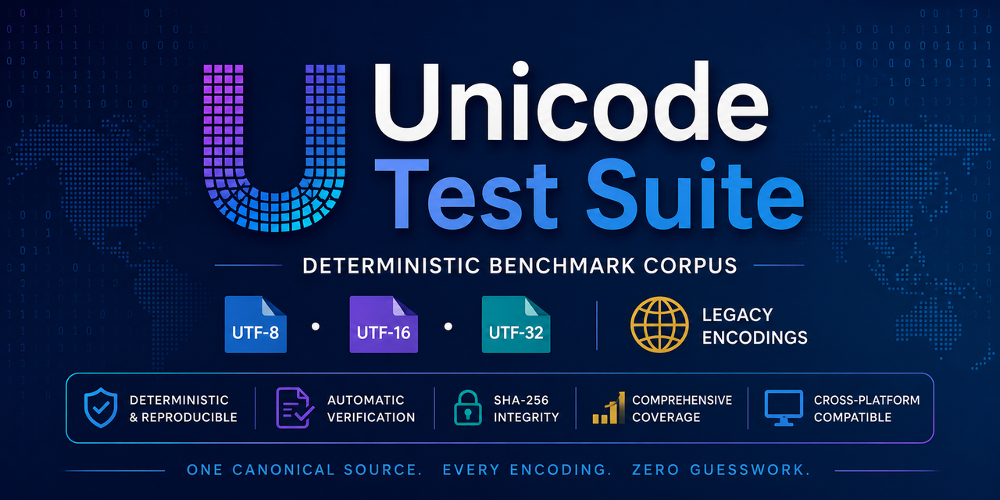

# Unicode Test Suite (UTS)

> **A deterministic, reproducible benchmark corpus for Unicode and text-encoding detection.**

Unicode Test Suite (UTS) is a benchmark corpus for validating and comparing text-encoding detectors, Unicode decoders, converters, editors, file analyzers, and related software.

Every generated file is deterministically produced from a canonical Unicode source, automatically verified after generation, and protected by cryptographic hashes to guarantee long-term reproducibility.

---

## Project

- **Repository:** https://github.com/amrali-eg/UnicodeTestSuite
- **Latest Releases:** https://github.com/amrali-eg/UnicodeTestSuite/releases
- **Issue Tracker:** https://github.com/amrali-eg/UnicodeTestSuite/issues

## Features

- Deterministic corpus generation
- Bit-identical reproducible output
- Set-valued detection ground truth
- Long-form natural-language samples
- Cross-platform
- Versioned releases
- Machine-readable metadata
- Automatic post-generation verification
- SHA-256 integrity verification
- Stable document identifiers
- Stable filenames
- Stable manifest format
- Extensible architecture
- Public benchmark quality

## Encoding Compatibility

UnicodeTestSuite intentionally includes only character encodings that can be used reliably across both **Python** and **.NET**.

When selecting encodings, priority was given to identifiers that satisfy the following requirements:

* Supported by Python's standard `codecs` module.
* Supported by `.NET Encoding.GetEncoding()`.
* Represent a single, well-defined encoding implementation.
* Avoid ambiguous aliases that resolve to different implementations across platforms.

Several encodings and aliases were intentionally excluded because they either duplicate another implementation or cannot be resolved consistently in .NET. For example:

* `cp932` is represented by `shift_jis`.
* `gbk` is represented by `gb2312` in .NET.
* Unsupported ISO-8859 variants and ambiguous aliases were removed after live validation.

As a result, every encoding name used throughout the corpus can be parsed directly by both Python and .NET without requiring custom lookup tables.

## Filename Format

Every generated filename follows the format:

```text
DocumentID_CategoryCode_CategoryName_Title_Encoding_[BOM_]LineEnding.ext
```

Example:

```text
DOC000036_10_Latin_Norwegian_windows-1253_LF.txt
DOC000066_15_CJK_Japanese_utf-16LE_BOM_LF.txt
```

The filename format was specifically designed for automated processing.

### Parsing Guarantees

The following properties are guaranteed for every document-derived filename:

* The encoding identifier is always the **fifth token** (index **4**) when splitting the filename on `_`.
* The category is always represented by a numeric code followed by its name.
* The optional `BOM` token appears only when a Byte Order Mark is present.
* Hyphens inside encoding names are preserved.
* Underscores inside encoding identifiers are converted to hyphens in filenames only, preventing the encoding from being split into multiple tokens.

These guarantees allow filenames to be parsed without consulting `Manifest.csv`, making the corpus suitable for automated testing and validation tools.

Every one of these properties is asserted at generation time, for every
document-derived file, and generation aborts if any filename would break
them. (In v2.0 two hand-built `.txt` filenames carried only four tokens,
putting the encoding out of reach at index 4; consumers parsing filenames
skipped them silently rather than failing. See CHANGELOG.md.)

The `.bin` fixtures under `11_InvalidUnicode/` and `13_Binary/` are **not**
document-derived and deliberately do not follow this format, as are the
three reference files in `00_Documentation/`. Filter on `.txt` with a
`DOC`-prefixed `DocumentID`, or use `Manifest.csv`.

### Supported Encodings

#### Unicode Transformation Formats

- UTF-8
- UTF-16 LE / BE
- UTF-32 LE / BE
- BOM and BOM-less variants

#### Legacy Encodings

- Windows code pages
- ISO-8859 family
- East Asian encodings
- Cyrillic encodings

#### Additional Test Sets

- Invalid Unicode test cases
- Binary signature corpus
- Line-ending corpus, including a CR/LF/CRLF matrix across encodings
- Large-file corpus
- Long-form natural-language corpus (24 languages, multi-kilobyte)

---

## Corpus Guarantees

Every published corpus guarantees:

- **One canonical Unicode source** for every document
- **Deterministic generation**
- **Bit-identical regeneration**
- **Stable document IDs**
- **Stable filenames**
- **Stable manifest**
- **Cryptographic integrity**
- **Automatic verification**
- **Long-term reproducibility**
- **Public benchmark quality**

Given the same:

- Generator version
- Unicode version
- Source documents

the generated corpus is guaranteed to be **byte-for-byte identical**.

---

## Corpus Contents

Version 3.0 contains:

| Item | Count |
|------|------:|
| Root folders | 16 |
| Categories | 21 |
| Distinct encodings | 35 |
| Canonical documents | 94 |
| Long-form documents | 24 |
| Generated files | 1,359 |

The corpus includes:

- Unicode transformation formats
- Legacy encodings
- Invalid Unicode samples
- Binary signature files
- Line-ending variants, including CR/CRLF across UTF-16, UTF-32 and legacy code pages
- Large text files
- Long-form natural-language text, several kilobytes per encoding

---

## Detection Ground Truth

A byte sequence is frequently valid, and decodes identically, under many
encodings at once. Pure-ASCII content is legitimately readable as
`us-ascii`, `utf-8`, every Windows code page and every ISO-8859 part —
all at the same time.

`Manifest.csv` therefore carries an **`AlsoValidAs`** column listing every
other encoding that decodes a file's bytes to the *same characters*.
Ground truth is a set, not a single string:

```text
Encoding:     utf-8
AlsoValidAs:  big5;euc-jp;...;us-ascii;windows-1250;...;windows-1258
```

**Benchmark harnesses should score set membership**, accepting a detector's
answer when it is either the declared `Encoding` or a member of
`AlsoValidAs`. Scoring string equality against `Encoding` alone penalizes
correct answers: a detector reporting `ascii` for pure-ASCII content — if
anything the more precise answer — is right, and the corpus says so.

The set is computed from the bytes themselves rather than from which
duplicates the corpus happens to contain, so it is complete regardless of
which encodings a given document was emitted in. Equality is tested on
decoded characters, not on byte round-tripping: every single-byte codec
reverses arbitrary input exactly, so a round-trip test would call UTF-8
Japanese "also valid as iso-8859-1", which is mojibake rather than an
alternative reading.

---

## Sample Length

Detection and round-tripping need different things from a corpus, so it
provides both.

The per-category documents are short by design — a line or two — which
exercises codec round-trips precisely. Statistical detectors
(uchardet, chardet, UTF.Unknown and other Mozilla-UDE descendants) build
byte-frequency and bigram models and need hundreds of bytes to converge,
so `15_LongForm/` supplies multi-kilobyte natural-language text in every
encoding capable of representing it:

| | Files | Median | Under 64 B |
|---|---:|---:|---:|
| Short legacy samples | 317 | 35 B | 82% |
| `15_LongForm/` legacy samples | 51 | 13,027 B | 0% |

Long-form source text comes from the UDHR in Unicode project, pinned by
SHA-256; see `data/udhr/PROVENANCE.md` for the artifact, its attribution
and copyright notice, the two documented character substitutions, and the
sources that were considered and rejected.

Each long-form document is emitted **only into the encodings that
historically carried its language**, not into every encoding capable of
representing the bytes. GB18030 can encode German and EUC-JP can encode
Polish, but no detector can be expected to identify German prose as
EUC-JP: the byte statistics look like Latin text, because that is what
they are. Such a file is a valid encoding and a meaningless detection
target. Measured against a real detector, accuracy on the long-form set
was 92.3% where the language matched the encoding and 60.0% where it did
not, and the cross-script pairings outnumbered the real ones 70 to 52 -
enough to hide the benefit of long-form samples entirely. The mapping is
`LONGFORM_ENCODINGS` in `generator/longform.py`.

## Automatic Verification

Every generated text file is automatically verified.

Generation performs the following steps:

1. Encode the canonical Unicode document.
2. Write the encoded file to disk.
3. Reopen the generated file.
4. Decode it using its declared encoding.
5. Compare the decoded text with the canonical source.
6. Compute and verify its SHA-256 hash.

A corpus is considered valid **only if every generated file passes every verification step**.

---

## Integrity Verification

Every corpus release contains:

- `Manifest.csv`
- `Manifest.sqlite`
- `ManifestVersion.txt`
- `MasterHashes.sha256`
- `CorpusCertificate.txt`

The certificate is the anchor of the chain. It is written last and records
the SHA-256 of every metadata file that `MasterHashes.sha256` cannot cover,
including `MasterHashes.sha256` itself:

```text
CorpusCertificate.txt
  -> MasterHashes.sha256, Manifest.csv, Manifest.sqlite, ...
       -> every generated file
```

Verify an existing corpus using the generator:

```bash
python GenerateCorpus.py verify
```

or, for a corpus that lives somewhere else:

```bash
python GenerateCorpus.py verify --corpus /path/to/UnicodeTestSuite
```

`verify` re-checks the metadata hashes against the certificate, re-checks
every file against the manifest, re-decodes each one under its declared
encoding, and fails if any file is present on disk but absent from the
manifest.

Or verify the file hashes alone using the standard SHA-256 format:

```bash
sha256sum -c MasterHashes.sha256
```

Note that `sha256sum` checks only the files listed in
`MasterHashes.sha256`; it cannot detect an added file or a modified
manifest. Use `GenerateCorpus.py verify` for the full chain.

### Regenerating

```bash
python GenerateCorpus.py generate
```

Generation deletes and rebuilds the corpus directory. If it already
exists, the generator asks for confirmation; pass `--force` to skip the
prompt in a non-interactive session, and `--corpus DIR` to build
somewhere other than the default.

---

## Source Overrides

The generator supports optional document overrides.

Place UTF-8 files inside:

```text
Source/
```

using the document ID as the filename:

```text
Source/
    DOC000001.txt
    DOC000042.txt
```

During generation, any matching file replaces the built-in document while preserving its:

- Document ID
- Filename
- Category
- Metadata

If the `Source/` directory is empty (the normal and recommended state), the built-in canonical documents are used.

---

## Version Information

Every generated corpus records:

- Generator version
- Manifest version
- Python version
- Platform
- Unicode version
- Generation timestamp
- SHA-256 master hash

---

## Repository Structure

```text
UnicodeTestSuiteGenerator/
¦
+-- GenerateCorpus.py          # Corpus generator
+-- generator/                 # Generator source code
+-- tests/                     # Generator unit tests
+-- data/udhr/                 # Vendored long-form source text
+-- Source/                    # Optional document overrides
+-- UnicodeTestSuite/          # Generated benchmark corpus
    ¦
    +--- Manifest.csv
    +--- Manifest.sqlite
    +--- ManifestVersion.txt
    +--- MasterHashes.sha256
    +--- CorpusCertificate.txt
    +--- Index.html
    +--- Statistics.txt
    +--- README.md
```
---

## Intended Uses

Unicode Test Suite is intended for:

- Encoding detector validation
- Unicode decoder testing
- Converter regression testing
- Text editor validation
- File analyzer testing
- Parser testing
- Continuous Integration (CI)
- Performance benchmarking
- Cross-platform compatibility testing

---

## License

The project uses separate licenses for code and generated data.

| Component | License | File |
|----------|---------|------|
| Generator | MIT License | `LICENSE` |
| Generated corpus | CC BY 4.0 | `LICENSE-CORPUS` |

The long-form documents under `15_LongForm/` are derived from the UDHR in
Unicode project and remain subject to the notice carried by their source
files, preserved verbatim in `data/udhr/`. The CC BY 4.0 grant does not
extend to that third-party text. See `data/udhr/PROVENANCE.md`.

## Related Projects

[`chardet/test-data`](https://github.com/chardet/test-data) is a large
corpus of natural, real-world encoded text assembled for the chardet
detector. It complements this project rather than overlapping with it:
UTS is synthetic, deterministic and hash-verified, with machine-readable
ground truth; chardet's data is messy and organic, and its files are
individually copyright their respective publishers. Running a detector
against both is worthwhile.
